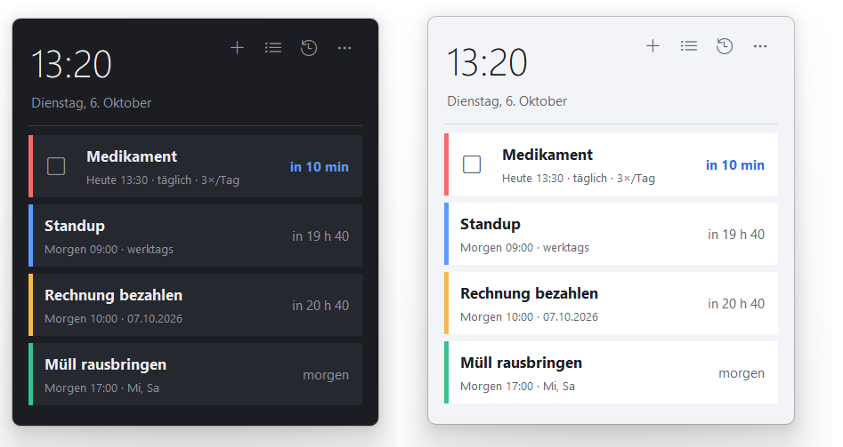
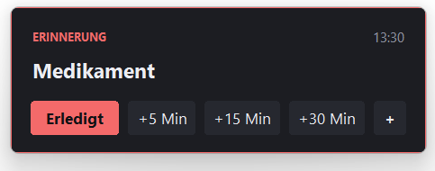
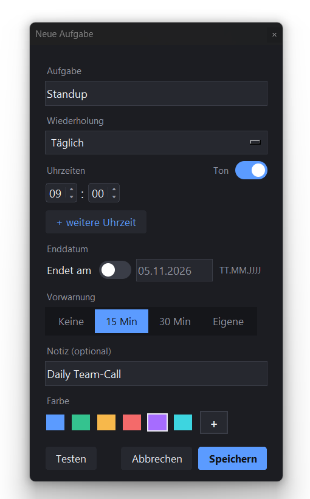
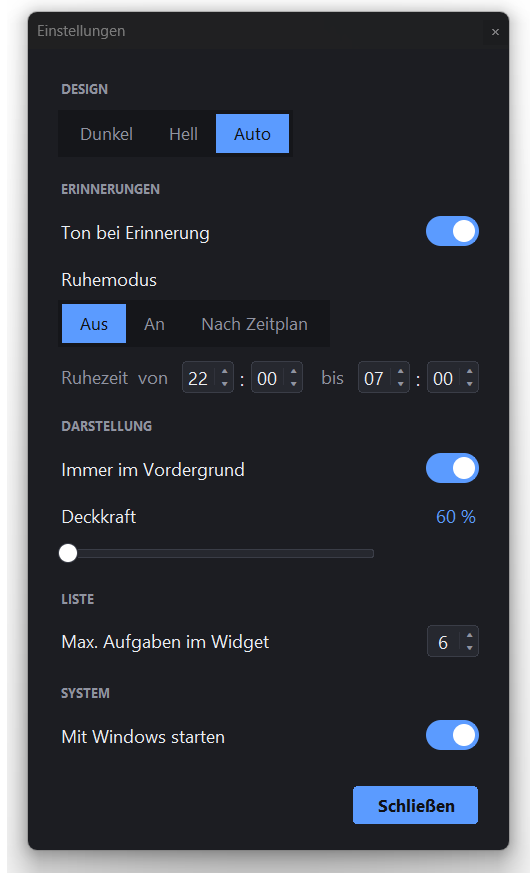
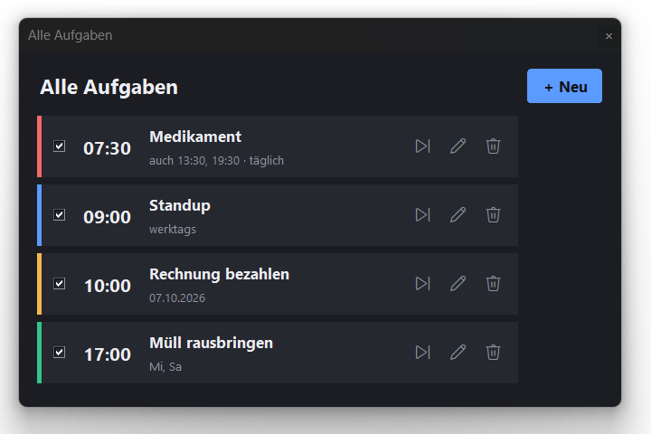
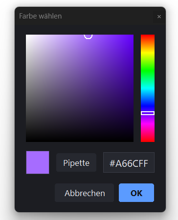

# TaskWidgets


Ein schlankes Erinnerungs-Widget für den Windows-11-Desktop. Es zeigt Uhrzeit und
die nächsten Aufgaben direkt auf dem Bildschirm und meldet sich zur eingestellten Zeit
mit einer Erinnerung und einem Ton. Ohne Installation, ohne Konto, läuft komplett lokal –
geschrieben in reinem Python 3 mit `tkinter`, **ohne externe Pakete**.



## Funktionen

- 🕒 Immer sichtbares Widget mit Uhr und den nächsten Aufgaben samt Countdown
- 🔔 Erinnerungen mit Ton – abhaken, überspringen oder schlummern (+5/+15/+30 Min oder eigene Zeit)
- ✅ Tägliches Erledigt-Häkchen pro Termin
- 🔁 Viele Wiederholungen: täglich, werktags, Wochenende, eigene Tage, alle paar Stunden, monatlich, alle 2 Wochen, einmalig
- ⏱️ Mehrere Uhrzeiten pro Aufgabe (z. B. Medikament um 8, 14 und 20 Uhr) – jeder Termin einzeln abhakbar
- 📅 Enddatum für Wiederholungen (z. B. „täglich bis 31.12.")
- ⏰ Vorwarnungen (z. B. 15 oder 30 Minuten vorher)
- 🌙 Ruhemodus – an/aus oder nach Zeitplan; Verpasstes kommt danach gesammelt
- 🎨 Helles und dunkles Design (auf Wunsch automatisch nach Windows), eigene Farben inkl. Pipette
- 🗂️ Verlauf der letzten 7 Tage
- 📌 Symbol im Infobereich der Taskleiste, frei verschieb- und skalierbar
- 💾 Export / Import der Aufgaben für andere PCs
- ⚙️ Alle Optionen gebündelt im Einstellungsfenster · Erststart-Assistent

## Screenshots

| Erinnerung | Aufgabe anlegen |
|:---:|:---:|
|  |  |

| Einstellungen | Alle Aufgaben |
|:---:|:---:|
|  |  |

| Eigener Farbwähler mit Pipette |
|:---:|
|  |

## Start aus dem Quellcode

Voraussetzung: **Python 3** für Windows (tkinter ist dabei). Keine weitere Software nötig.

```bash
python TaskWidgets.pyw
```

oder als Paket:

```bash
python -m taskwidgets
```

Zum normalen Betrieb ohne Konsolenfenster `pythonw TaskWidgets.pyw` nutzen.

> Die Aufgaben liegen in `%APPDATA%\TaskWidgets\data.json` (pro Benutzer, lokal).

## Eigene .exe bauen (optional)

Mit [PyInstaller](https://pyinstaller.org/) lässt sich eine eigenständige `.exe` erzeugen:

```bash
pip install pyinstaller
pyinstaller --onefile --windowed --icon taskwidgets/icon.ico ^
    --add-data "taskwidgets/icon.ico;taskwidgets" --name TaskWidgets TaskWidgets.pyw
```

> Hinweis: PyInstaller-`.exe`-Dateien werden von manchen Virenscannern fälschlich als
> Bedrohung gemeldet (bekannter *False Positive* durch den Bootloader). Der Quellcode
> liegt hier offen; wer sichergehen will, baut die `.exe` selbst oder startet direkt aus
> dem Quellcode.

## Projektaufbau

Der Code ist nach Zuständigkeit in Module aufgeteilt:

| Modul | Inhalt |
|------|--------|
| `config` | Konstanten, Farbpaletten, Theme-/DPI-System |
| `storage` | `data.json` laden/speichern/migrieren |
| `recurrence` | Wiederholungen und Termin-Berechnung |
| `platform_win` | Windows-Helfer: DPI, Titelleiste, Ecken, Pipette, Autostart, Verknüpfung |
| `winapi` | Infobereich-Symbol (Tray) und Einzelinstanz-Prüfung |
| `widgets` | Wiederverwendbare tkinter-Bausteine im Programmdesign |
| `reminder` | Erinnerungs-Pop-ups und Schlummer-Dialog |
| `colorpicker` | Eigener Farbwähler mit Pipette |
| `editor` | Aufgaben-Editor |
| `lists` | Fenster „Alle Aufgaben" und „Verlauf" |
| `settings_dialogs` | Ruhezeiten, Einstellungsfenster, Erststart-Assistent |
| `app` | Haupt-Widget und App-Steuerung (Einstieg `main`) |

Die Theme-Farben sind veränderliche Werte in `config`; beim Umschalten zwischen Hell und
Dunkel verteilt `config.set_palette()` die neue Palette live an alle Module.

## Bedienung

- **Menü:** Rechtsklick aufs Widget oder das **⋯**-Symbol
- **Einstellungen:** alle Optionen gebündelt unter **⋯ → Einstellungen …**
- **Verschieben:** an freier Fläche ziehen · **Größe ändern:** an Rand oder Ecke ziehen
- **Ein-/Ausblenden:** Linksklick auf das Symbol im Infobereich der Taskleiste
- **Beenden:** Menü → Beenden

## KI-Unterstützung

Konzept und alle fachlichen Entscheidungen stammen von mir; die Umsetzung erfolgte
mit KI-Unterstützung (Claude Code). Das dokumentierte Vorgehen – inklusive
Architektur und Qualitätssicherung – steht in
[docs/KI-Entwicklungsprozess.md](docs/KI-Entwicklungsprozess.md).

## Credits

Erstellt von **ErcoBuilds** · [GitHub: @ErcoBuilds](https://github.com/ErcoBuilds)
Lizenz: MIT (siehe [LICENSE](LICENSE)) · Nur für Windows 10/11.
